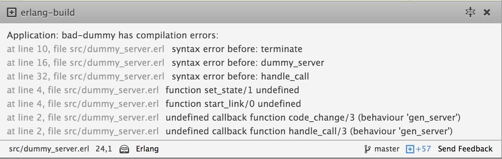

# Atom Erlang Build package
### Erlang build shortcuts in Atom


> Compilation Error panel

## Installation

```bash
$ apm install erlang-build
```

## Prerequisites

The Erlang-Build package uses the [Rebar](https://github.com/rebar/rebar) build
tool, so your program must use rebar.

## Usage

## Known Issues

## Features

 * Compile rebar appliations on project save
 * Display compilation success or failure with compilation errors

## TODO
> A lot...

 * Add rebar path detection
 * Add line preview in message-pane
 * Add in-editor highlighting of error/warning messages
 * Add styles to messages
 * Add [EUnit](http://www.erlang.org/doc/apps/eunit/chapter.html) support
 * Add [Dialyzer](http://www.erlang.org/doc/man/dialyzer.html) support
 * Add [Cover](http://www.erlang.org/doc/man/cover.html) support
 * Add [Wrangler](https://github.com/RefactoringTools/wrangler) support
 * Add [Smother](https://github.com/ramsay-t/Smother) support
 * Add [Skel](https://github.com/ParaPhrase/skel) support
